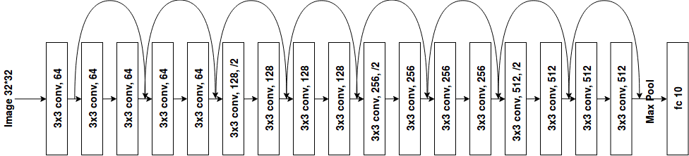

# CNNs
The code in this repo formed part of a coursework completed for the 'Deep Learning' course. It is written in PyTorch, and is split into different parts

A summary of the parts is as follows:
1. Part 1: define the 2D convolution, max pooling operation, linear layer and 2D batch normalization
2. Part 2: train a ResNet-18  on the CIFAR-10 dataset
3. Part 3: answers to questions

